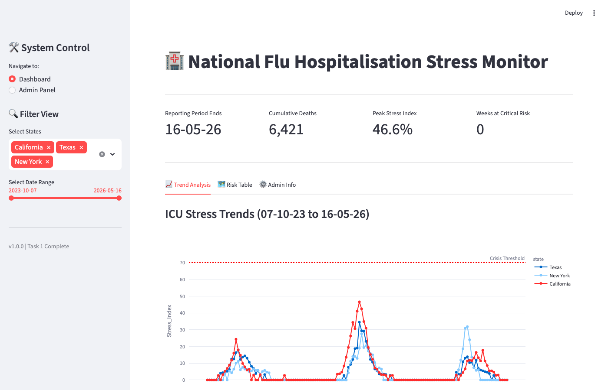

# National Flu Stress Monitor

A Streamlit dashboard for US public health surveillance.

 Fetches live provisional influenza mortality data from the CDC API, merges it with static hospital capacity records, and calculates a per-state Healthcare Stress Index to quantify ICU strain in near real time.

---

## What it does

- **Live data ingestion** — pulls weekly provisional influenza death counts from the CDC Open Data API (dataset `r8kw-7aab`)
- **Stress Index calculation** — applies the UKHSA 1:15 staffing model to estimate ICU pressure:

  ```
  Stress Index = (flu_deaths × 15 / ICU_Beds) × 100
  ```

- **Risk classification** — labels each state-week as Low / Moderate / High / Critical based on CDC thresholds
- **Interactive dashboard** — state and date filters, trend line charts (Plotly), KPI cards, and a colour-coded risk table
- **Admin panel** — CRUD interface for updating hospital bed capacity per state, persisted to the database
- **Offline resilience** — falls back to a local SQLite cache when the CDC API is unreachable

---

## Tech stack

| Layer | Technology |
|---|---|
| Dashboard | Streamlit, Plotly |
| Data processing | pandas |
| API | CDC Open Data (Socrata) via `requests` |
| Persistence | SQLite (via `sqlite3`) |
| Testing | pytest |
| Architecture | Service-Repository pattern |

---

## Installation

```bash
# 1. Clone the repo
git clone <repo-url>
cd <repo-name>

# 2. Create and activate a virtual environment (recommended)
python -m venv venv
source venv/bin/activate   # Windows: venv\Scripts\activate

# 3. Install dependencies
pip install -r requirements.txt
```

---

## Running the app

```bash
# Run the ETL pipeline (fetches data and populates the local cache)
python main.py

# Launch the Streamlit dashboard
streamlit run app.py

# Run the test suite
python -m pytest
```

The dashboard fetches live data automatically on load. If the CDC API is unavailable, it falls back to the local SQLite cache populated by the last successful sync. You can also trigger a manual sync from the Admin Panel inside the app.

---

## Data setup (optional — for refreshing hospital capacity)

The static capacity file (`01_Data/us_states_capacity.csv`) is included and ready to use. If you want to regenerate it from the raw HHS hospital utilisation data:

1. Download the raw dataset from the [HHS Protect Public Data Hub](https://healthdata.gov)
2. Save it as `01_Data/raw_hospital_data.csv`
3. Run: `python etl_setup.py`

---

## Project structure

```
├── 00_Docs/
│   └── diagrams/
│       ├── er_diagram.png
│       ├── UML_class_diagram.png
│       ├── UML_use_case_diagram.png
│       ├── layered_stack_diagram.png
│       └── sequence_diagram.png
├── 01_Data/
│   └── us_states_capacity.csv    # Static US state hospital/ICU capacity
├── src/
│   ├── ui/
│   │   ├── dashboard.py          # Streamlit dashboard view
│   │   └── admin.py              # Admin CRUD panel
│   ├── database.py               # SQLite DAO (DatabaseAdapter)
│   ├── repository.py             # CDC API client (FluDataRepository)
│   ├── service.py                # ETL and business logic (FluDashBoardService)
│   └── log_config.py             # Logging configuration
├── tests/
│   ├── test_app.py
│   ├── test_database.py
│   ├── test_enhancement.py
│   ├── test_service.py
│   └── test_ui.py
├── app.py                        # Streamlit entry point
├── main.py                       # Standalone ETL entry point
├── etl_setup.py                  # One-time hospital capacity data prep
└── requirements.txt
```

---

## Architecture

The project uses a layered **Service-Repository** pattern to separate concerns:

```
CDC API ──► FluDataRepository  (src/repository.py)
                │
                ▼
         FluDashBoardService  (src/service.py)
         ├── merges API data with hospital CSV
         ├── calculates Stress Index & Risk Level
         └── persists results to SQLite cache
                │
                ▼
         Streamlit UI  (src/ui/)
         ├── dashboard.py  — charts, KPIs, risk table
         └── admin.py      — capacity CRUD panel
```

---

## Author

Dawood Ahmed Butt
